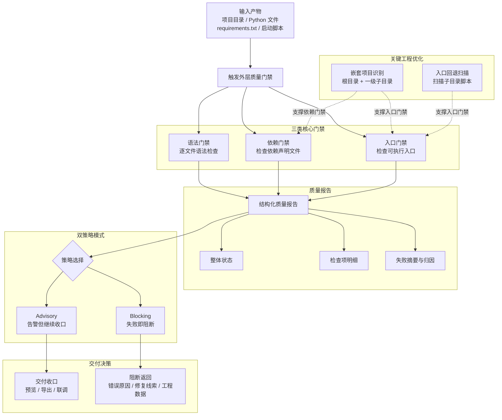

```mermaid
graph TD

A[输入产物\n项目目录 / Python 文件\nrequirements.txt / 启动脚本]
B[触发外层质量门禁]

A --> B

subgraph C[三类核心门禁]
direction TB
C1[语法门禁\n逐文件语法检查]
C2[依赖门禁\n检查依赖声明文件]
C3[入口门禁\n检查可执行入口]
end

B --> C1
B --> C2
B --> C3

subgraph D[关键工程优化]
direction TB
D1[嵌套项目识别\n根目录 + 一级子目录]
D2[入口回退扫描\n扫描子目录脚本]
end

D1 -.支撑依赖门禁.-> C2
D1 -.支撑入口门禁.-> C3
D2 -.支撑入口门禁.-> C3

subgraph E[质量报告]
direction TB
E1[结构化质量报告]
E2[整体状态]
E3[检查项明细]
E4[失败摘要与归因]
E1 --> E2
E1 --> E3
E1 --> E4
end

C1 --> E1
C2 --> E1
C3 --> E1

subgraph F[双策略模式]
direction TB
F1{策略选择}
F2[Advisory\n告警但继续收口]
F3[Blocking\n失败即阻断]
F1 --> F2
F1 --> F3
end

E1 --> F1

subgraph G[交付决策]
direction TB
G1[交付收口\n预览 / 导出 / 联调]
G2[阻断返回\n错误原因 / 修复线索 / 工程数据]
end

F2 --> G1
F3 --> G2

```