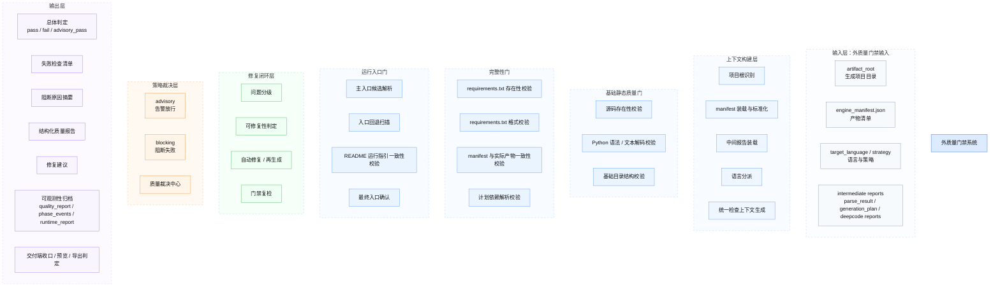

```mermaid
```mermaid
flowchart TB

title_main["外质量门禁系统"]

subgraph input_layer["输入层：外质量门禁输入"]
    in_artifact["artifact_root<br/>生成项目目录"]
    in_manifest["engine_manifest.json<br/>产物清单"]
    in_runtime["target_language / strategy<br/>语言与策略"]
    in_reports["intermediate reports<br/>parse_result / generation_plan / deepcode reports"]
end

subgraph context_layer["上下文构建层"]
    ctx_root["项目根识别"]
    ctx_manifest["manifest 装载与标准化"]
    ctx_reports["中间报告装载"]
    ctx_dispatch["语言分派"]
    ctx_quality["统一检查上下文生成"]
end

subgraph static_gate_layer["基础静态质量门"]
    sg_source["源码存在性校验"]
    sg_syntax["Python 语法 / 文本解码校验"]
    sg_structure["基础目录结构校验"]
end

subgraph integrity_gate_layer["完整性门"]
    ig_req_exist["requirements.txt 存在性校验"]
    ig_req_format["requirements.txt 格式校验"]
    ig_manifest_real["manifest 与实际产物一致性校验"]
    ig_plan_dep["计划依赖解析校验"]
end

subgraph entry_gate_layer["运行入口门"]
    eg_candidates["主入口候选解析"]
    eg_fallback["入口回退扫描"]
    eg_readme["README 运行指引一致性校验"]
    eg_resolve["最终入口确认"]
end

subgraph fix_layer["修复闭环层"]
    fx_classify["问题分级"]
    fx_fixable["可修复性判定"]
    fx_repair["自动修复 / 再生成"]
    fx_recheck["门禁复检"]
end

subgraph decision_layer["策略裁决层"]
    dc_advisory["advisory<br/>告警放行"]
    dc_blocking["blocking<br/>阻断失败"]
    dc_center["质量裁决中心"]
end

subgraph output_layer["输出层"]
    out_status["总体判定<br/>pass / fail / advisory_pass"]
    out_failed["失败检查清单"]
    out_summary["阻断原因摘要"]
    out_report["结构化质量报告"]
    out_advice["修复建议"]
    out_archive["可观测性归档<br/>quality_report / phase_events / runtime_report"]
    out_release["交付端收口 / 预览 / 导出判定"]
end

classDef title fill:#DCEBFF,stroke:#7AA7E8,color:#111,stroke-width:1.5px;
classDef input fill:#F7FAFC,stroke:#94A3B8,color:#111,stroke-width:1px;
classDef context fill:#EEF6FF,stroke:#7AA7E8,color:#111,stroke-width:1px;
classDef gate fill:#EAF4FF,stroke:#6EA8FE,color:#111,stroke-width:1px;
classDef fix fill:#EFFFF4,stroke:#63C174,color:#111,stroke-width:1px;
classDef decision fill:#FFF4E8,stroke:#F0A35E,color:#111,stroke-width:1px;
classDef output fill:#F9F5FF,stroke:#A78BFA,color:#111,stroke-width:1px;

class title_main title;

class in_artifact,in_manifest,in_runtime,in_reports input;
class ctx_root,ctx_manifest,ctx_reports,ctx_dispatch,ctx_quality context;
class sg_source,sg_syntax,sg_structure,ig_req_exist,ig_req_format,ig_manifest_real,ig_plan_dep,eg_candidates,eg_fallback,eg_readme,eg_resolve gate;
class fx_classify,fx_fixable,fx_repair,fx_recheck fix;
class dc_advisory,dc_blocking,dc_center decision;
class out_status,out_failed,out_summary,out_report,out_advice,out_archive,out_release output;

style input_layer fill:#FBFDFF,stroke:#CBD5E1,stroke-width:1px,stroke-dasharray: 5 5;
style context_layer fill:#F8FBFF,stroke:#BFDBFE,stroke-width:1px,stroke-dasharray: 5 5;
style static_gate_layer fill:#F8FBFF,stroke:#BFDBFE,stroke-width:1px,stroke-dasharray: 5 5;
style integrity_gate_layer fill:#F8FBFF,stroke:#BFDBFE,stroke-width:1px,stroke-dasharray: 5 5;
style entry_gate_layer fill:#F8FBFF,stroke:#BFDBFE,stroke-width:1px,stroke-dasharray: 5 5;
style fix_layer fill:#F6FFF8,stroke:#B7E4C7,stroke-width:1px,stroke-dasharray: 5 5;
style decision_layer fill:#FFF9F2,stroke:#F7C59F,stroke-width:1px,stroke-dasharray: 5 5;
style output_layer fill:#FCFAFF,stroke:#DDD6FE,stroke-width:1px,stroke-dasharray: 5 5;

```
```