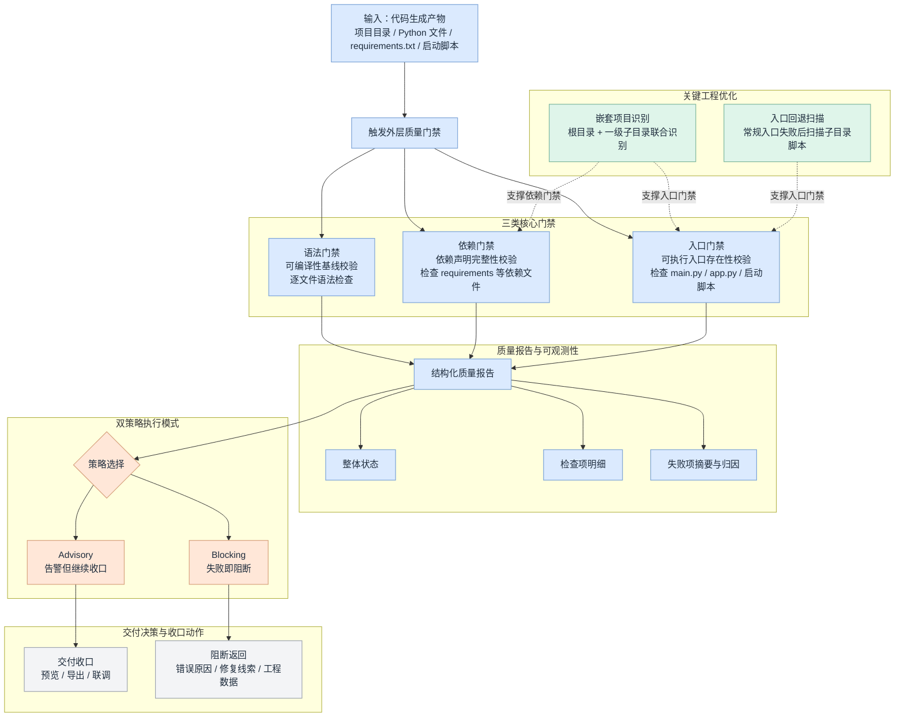

```mermaid

flowchart TD
    A[输入：代码生成产物<br/>项目目录 / Python 文件 / requirements.txt / 启动脚本]

    B[触发外层质量门禁]

    subgraph C[三类核心门禁]
        direction TB
        C1[语法门禁<br/>可编译性基线校验<br/>逐文件语法检查]
        C2[依赖门禁<br/>依赖声明完整性校验<br/>检查 requirements 等依赖文件]
        C3[入口门禁<br/>可执行入口存在性校验<br/>检查 main.py / app.py / 启动脚本]
    end

    subgraph D[关键工程优化]
        direction TB
        D1[嵌套项目识别<br/>根目录 + 一级子目录联合识别]
        D2[入口回退扫描<br/>常规入口失败后扫描子目录脚本]
    end

    subgraph E[质量报告与可观测性]
        direction TB
        E1[结构化质量报告]
        E2[整体状态]
        E3[检查项明细]
        E4[失败项摘要与归因]
        E1 --> E2
        E1 --> E3
        E1 --> E4
    end

    subgraph F[双策略执行模式]
        direction TB
        F1{策略选择}
        F2[Advisory<br/>告警但继续收口]
        F3[Blocking<br/>失败即阻断]
        F1 --> F2
        F1 --> F3
    end

    subgraph G[交付决策与收口动作]
        direction TB
        G1[交付收口<br/>预览 / 导出 / 联调]
        G2[阻断返回<br/>错误原因 / 修复线索 / 工程数据]
    end

    A --> B
    B --> C1
    B --> C2
    B --> C3

    D1 -.支撑依赖门禁.-> C2
    D1 -.支撑入口门禁.-> C3
    D2 -.支撑入口门禁.-> C3

    C1 --> E1
    C2 --> E1
    C3 --> E1

    E1 --> F1
    F2 --> G1
    F3 --> G2

    classDef main fill:#dbeafe,stroke:#7aa2d6,color:#1f2d3d,stroke-width:1.2px;
    classDef support fill:#dff5ea,stroke:#7bb59b,color:#1f2d3d,stroke-width:1.2px;
    classDef policy fill:#ffe7d8,stroke:#d6a07b,color:#1f2d3d,stroke-width:1.2px;
    classDef output fill:#f3f4f6,stroke:#9ca3af,color:#1f2d3d,stroke-width:1.2px;

    class A,B,C1,C2,C3,E1,E2,E3,E4 main;
    class D1,D2 support;
    class F1,F2,F3 policy;
    class G1,G2 output;

```